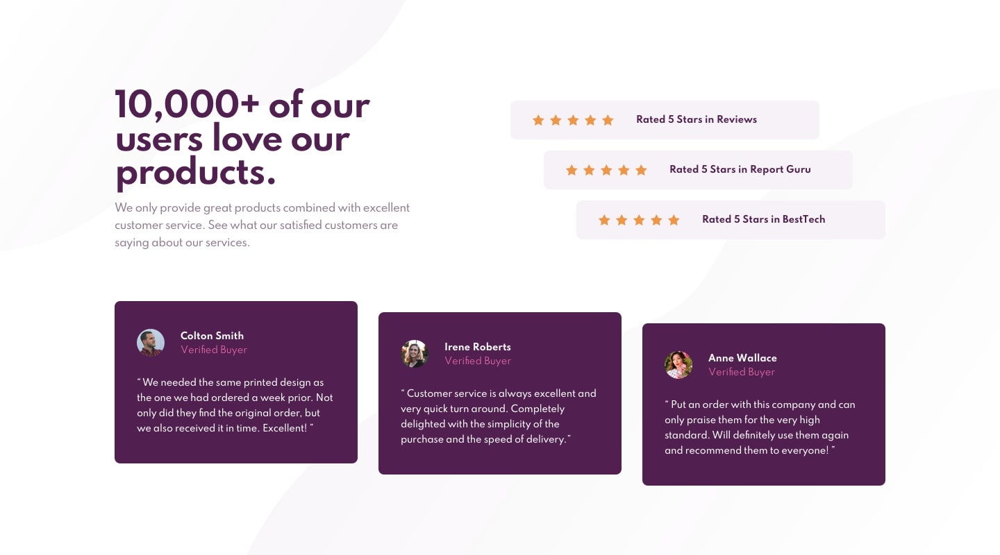

# Frontend Mentor - Social proof section solution

This is a solution to the [Social proof section challenge on Frontend Mentor](https://www.frontendmentor.io/challenges/social-proof-section-6e0qTv_bA). Frontend Mentor challenges help you improve your coding skills by building realistic projects.

## Table of contents

- [Overview](#overview)
  - [The Challenge](#the-challenge)
  - [Solution Screenshot](#screenshot)
  - [Useful Links](#links)
- [My process](#my-process)
  - [Built with](#built-with)
  - [What I learned](#what-i-learned)
  - [Continued development](#continued-development)
  - [Useful Resources](#useful-resources)
- [Author](#author)
- [Acknowledgments](#acknowledgments)

## Overview

### The challenge

Users should be able to:

- View the optimal layout for the section depending on their device's screen size

### Solution Screenshot



### Links

### Useful Links

- Solution URL: [Checkout Repository](https://github.com/beRajeevKumar/Community_Card.git).
- Live Site URL: [Visit Live](https://communitycard-rajeev.netlify.app/).
- Blog Post URL: [Read Blog](https://www.iamrajeev.me/blog/qr-code-component-using-html-and-css).

## My process

### Built with

- Semantic HTML5 markup
- CSS custom properties
- Flexbox
- CSS Grid
- Responsive design
- Desktop-first workflow

### What I learned

Use this section to recap over some of your major learnings while working through this project. Writing these out and providing code samples of areas you want to highlight is a great way to reinforce your own knowledge.

Some code snippets that I am proud of are:

```html
<h1>Some HTML code I'm proud of</h1>
```

```css
.proud-of-this-css {
  color: papayawhip;
}
```

### Continued development

I will continue to focus on improving my CSS skills. I will also focus on improving my responsive design skills. I will also focus on improving my CSS Grid and Flexbox skills.

### Useful Resources

- [Resource 01](https://developer.mozilla.org/en-US/docs/Learn/HTML) - This is an amazing articles which helped me finally understand HTML.
- [Resource 02](https://developer.mozilla.org/en-US/docs/Learn/CSS) - This is an amazing articles which helped me finally understand CSS.

I'd recommend to everyone to checkout these amazing official HTML & CSS resources.

## Author

- Website - [Portfolio](https://www.iamrajeev.me)
- Frontend Mentor - [@beRajeevKumar](https://www.frontendmentor.io/profile/beRajeevKumar)
- Twitter - [@be_rajeevkumar](https://x.com/be_rajeevkumar)

## Acknowledgments

I would like to thank Frontend Mentor for providing such an amazing platform to practice my coding skills. I would also like to thank the community for providing feedback on my projects and helping me improve my coding skills.

<hr>
<h1 align=center>Happy Coding 👨‍💻</h1>
